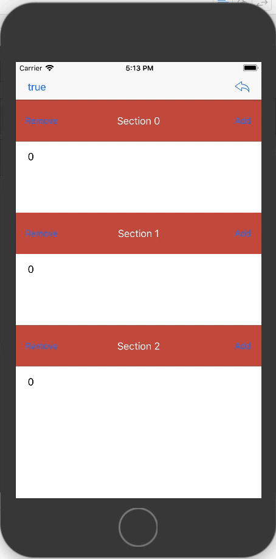
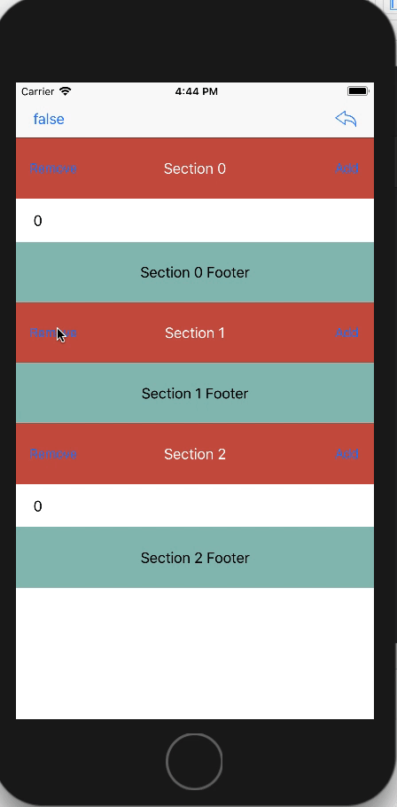

Using the left bar button to switch between `showHeaderWhenEmpty` mode on/off.

And using right bar button to reset data to default.

~~ If set `showHeaderWhenEmpty` to `false`, the header got wrong. ~~
Bug already fixed in latest commit.

